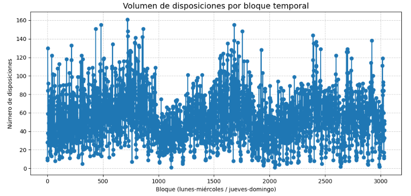
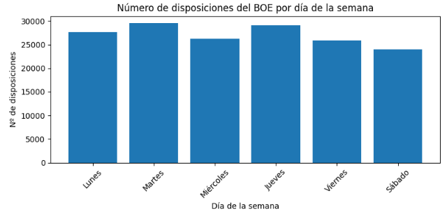
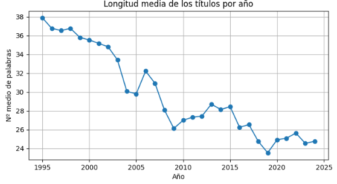

## Transformaciones principales

### 1. Análisis de datos faltantes

Identificamos 2 registros con valores nulos y los eliminamos ya que 2 entradas no son relevantes en los 160 mil registros que tenemos.

### 2. Limpieza de texto

Para limpiar el texto primero eliminamos las tildes y diacríticos, aunque mantenemos las mayúsculas para no perder información de entidades y nombres propios, principalmente universidades. También eliminamos los caracteres no alfabéticos: números, signos de puntuación, guiones…Además, sustituimos los espacios múltiples por uno solo.  
Por último, creamos dos columnas derivadas:
texto_limpio: texto con la limpieza aplicada manteniendo las mayúsculas para así obtener los nombres de universidades y de provincias más fácilmente.
texto_lower: texto limpio convertido a minúsculas para reducir el tamaño del vocabulario para el análisis de sentimiento, de tópicos y de temática con zero-shot learning.

### 3. Formato de fechas

Por otro lado, convertimos la columna Fecha_Publicacion al tipo datetime para obtener más información a partir de ella.
De la columna Fecha_Publicacion obtenemos:

- **Mes:** columna con el número de mes a la que pertenece cada disposición del boe
- **Trimestre:** trimestre a la que pertenece cada disposición 
- **Bloque temporal de 3 días:** creamos bloques de 3 días siendo estos de lunes a miércoles y de jueves a domingo (aunque los domingos no hay disposiciones). Usamos esta unidad para el posterior análisis temporal ya que nos proporciona suficientes entradas para un análisis coherente (alrededor de unas 3300 entradas). 

- Día de la semana: también añadimos una columna correspondiente al día de la semana para analizar el volumen por día.

### 4. Longitud de los títulos
Finalmente, creamos una columna con el número de palabras de cada título. 
Aprovechamos para analizar la longitud media de disposiciones con el paso de los años:

Como vemos en la gráfica, a lo largo del tiempo se ha ido reduciendo la longitud de las disposiciones.

## Conclusiones

Una vez hemos procesado todos los textos podemos proceder al análisis de los mismos y a la obtención de los indicadores tanto opcionales como obligatorios.
