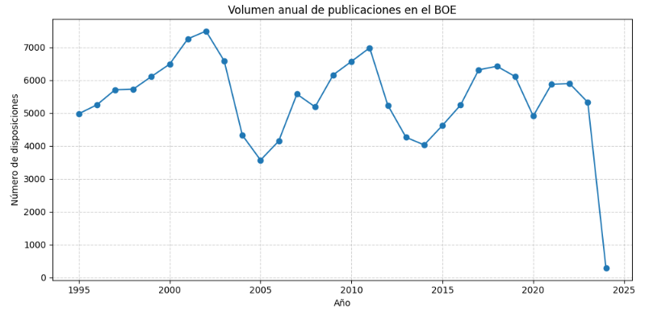
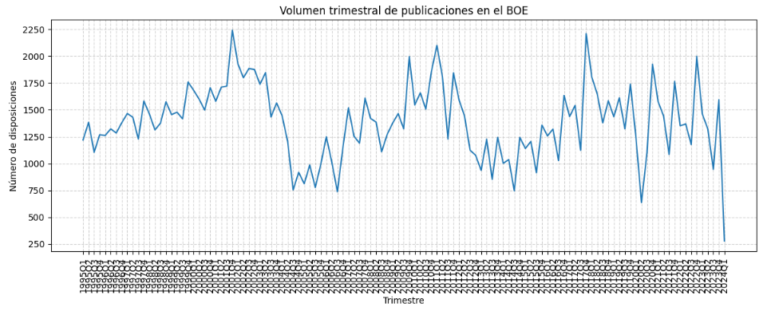
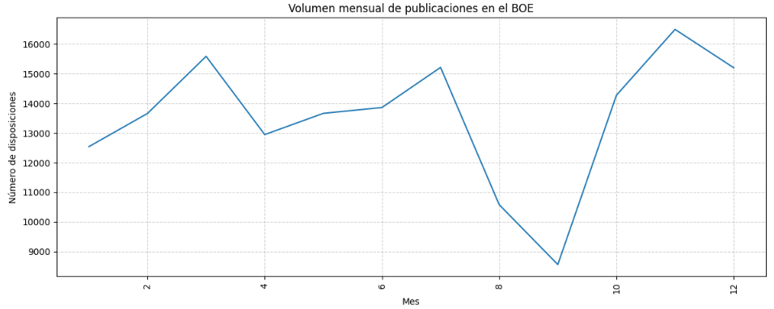
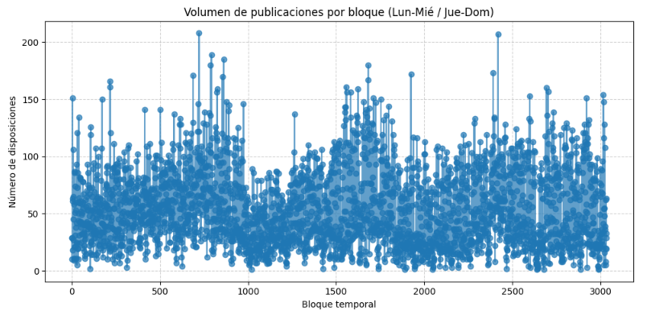
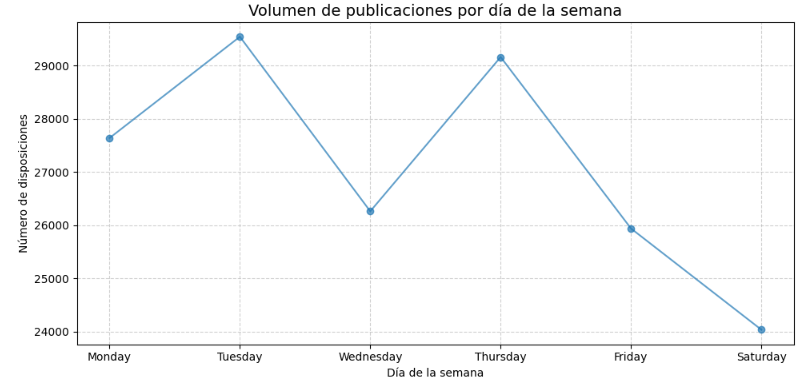
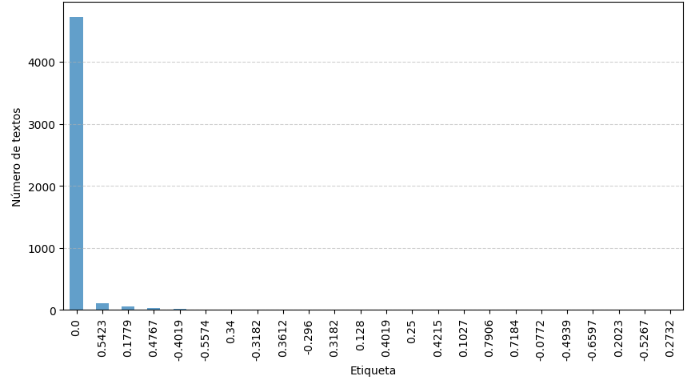
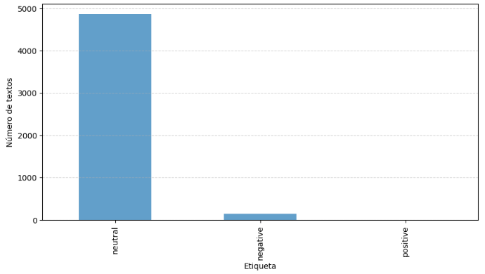
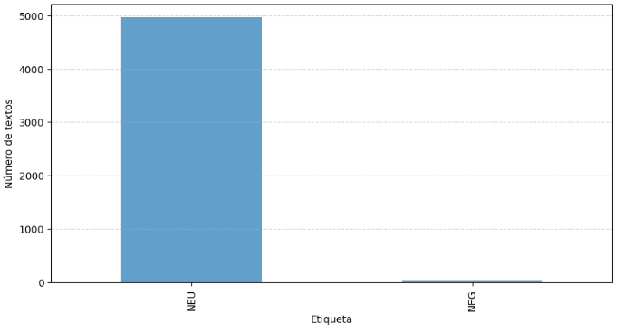
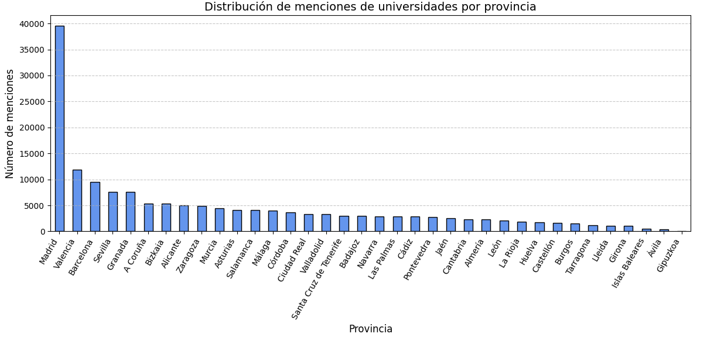

# Motivación

## 1. Objetivo General del Proyecto

El proyecto busca analizar cómo cambian los temas sobre los que el Ministerio de Universidades publica en el Boletín Oficial del Estado (BOE) a lo largo de los años.
Para ello, se procesan los titulares en español con el fin de identificar la evolución de los tópicos predominantes en el tiempo usando técnicas como zero-shot learning, así como su distribución geográfica y su posible relación con las características de cada entidad universitaria (pública o privada).

## 2. Pregunta de Investigación e Hipótesis

### **Hipótesis principal:**

“Entre 1995 y 2024, la proporción de titulares del BOE relacionados con tecnología en universidades públicas de la Comunidad de Madrid aumenta moderadamente (≈ +1.1% anual), mientras que los relativos a empleo muestran una tendencia variable con disminución general (≈ -2.3% anual), lo que sugiere un cambio gradual de foco institucional desde temas laborales hacia la innovación tecnológica.”

**Pregunta de investigación asociada:**

- ¿Existen diferencias en la distribución temática de los titulares del BOE según la comunidad autónoma o el tipo de universidad (pública/privada)?
- ¿En qué porcentaje aparecen las diferentes combinaciones de temática-tipo de universidad-provincia con el paso de los años? ¿Dicho porcentaje de aparición crece o disminuye?

## 3. Justificación del Dataset

### **Origen y características**

- Fuente: pauDCDC/boe_universidades
- Tamaño: 162.576 ejemplos
- Periodo temporal: 1995–2024
- Idioma: Español

### **Relevancia:**
El conjunto de datos es relevante porque permite analizar la evolución del discurso institucional y normativo del Ministerio de Universidades durante casi tres décadas. Al contener todos los titulares publicados en el BOE, ofrece una fuente oficial, homogénea y longitudinal que refleja las prioridades, políticas y cambios temáticos del sistema universitario español.
Además, al incluir menciones a universidades concretas, comunidades autónomas y provincias, posibilita examinar diferencias territoriales y tipológicas (pública/privada) en la atención institucional.
Esto lo convierte en una base valiosa para estudiar tendencias temáticas, frecuencia de publicación y tono institucional a lo largo del tiempo.

**Criterios de selección:**

- Representatividad temporal adecuada (30 años de datos continuos).
- Volumen suficiente para análisis estadísticos robustos.
- Contenido textual adecuado para tareas de modelado de tópicos y sentimiento.

## 4. Justificación de los Indicadores Calculados

### Indicadores obligatorios

El procesamiento de los indicadores mostrados a continuación pueden encontrarse en la carpeta "Indicadores obligatorios" en esta misma carpeta. 

#### 4.1 Volumen temporal de publicaciones
Para analizar el volumen temporal de publicaciones hemos visualizado los datos con diversas unidades temporales:

- **Tendencia anual**
  
 

En la gráfica se muestra una tendencia general de crecimiento, interrumpida por tres descensos significativos en los años 2005, 2014 y 2024.

En 2005, se observa una reducción pronunciada respecto a los años anteriores. Este descenso podría asociarse con procesos de reestructuración administrativa y cambios en la gestión universitaria derivados de la adaptación al Espacio Europeo de Educación Superior (EEES), conocido como Plan Bolonia, así como con las primeras fases de digitalización del Boletín Oficial del Estado, que comenzaron a introducirse progresivamente a mediados de la década de 2000.

La caída de 2014 coincide con un periodo de ajuste institucional y económico posterior a la crisis financiera de 2008–2013. En estos años se produjeron recortes en la contratación pública y una menor actividad administrativa, lo que probablemente redujo el número de resoluciones y convocatorias emitidas.

Finalmente, la disminución observada en 2024 parece responder a un efecto de datos incompletos, ya que los registros correspondientes al año más reciente no siempre se encuentran completamente disponibles en las fuentes abiertas.

- **Tendencia trimestral**
  
 

Aquí vemos más detalladamente una tendencia similar a la vista anualmente.

- **Tendencia mensual**
  
 

El análisis del volumen de disposiciones por mes revela un comportamiento estacional marcado en la actividad administrativa. En general, los meses de marzo, julio y noviembre presentan picos significativos en el número de resoluciones publicadas, mientras que septiembre muestra de forma consistente el menor volumen del año.

Este patrón puede explicarse por la organización del calendario administrativo y académico. Los aumentos de marzo y julio suelen coincidir con cierres de periodos administrativos o académicos, momentos en los que se concentran resoluciones de contratación, convocatorias y nombramientos. El incremento en noviembre puede vincularse con el cierre del ejercicio presupuestario y la necesidad de publicar disposiciones antes del fin de año.

Por el contrario, la caída en septiembre se explica probablemente por la pausa veraniega y la lenta reactivación de la actividad administrativa tras las vacaciones. En esos días, muchas oficinas aún no han retomado su ritmo habitual, lo que reduce el número de publicaciones. Este patrón se repite cada año, lo que indica que existe un comportamiento estacional regular en las disposiciones oficiales.

-**Tendencia por bloque de 3 días**

 

De este gráfico no podemos obtener muchas conclusiones todavía, quizá podamos distinguir el periodo que coincide con los años ya mencionados (2005, 2014) con una reducción en el número de disposiciones.

- **Tendencia por día de la semana**
  
 

El análisis de la distribución de publicaciones por día de la semana muestra que la mayor actividad se concentra los martes y los jueves, mientras que los sábados presentan el volumen más bajo. Aunque las diferencias no son muy pronunciadas —en torno a unas 2.000 disposiciones más respecto a otros días—, el patrón refleja el funcionamiento habitual de la administración pública, con mayor carga de trabajo y publicación en los días centrales de la semana.

El descenso de los fines de semana, especialmente el sábado, es coherente con la inactividad administrativa y la ausencia de nuevas resoluciones en días no laborables.
  
#### 4.2 Análisis de sentimiento

Otro de los análisis que hemos llevado acabo ha sido el análisis de sentimiento. No obstante, no esperábamos grandes resultados al ser un dataset con texto legal, con contenido mayoritariamente neutro. 
Para realizar el análisis usamos un subconjunto de los datos por su coste computacional.

Además, usamos tres modelos con distinto enfoque:

- VADER (de nltk): rápido y comúnmente usado para análisis de sentimiento.

 
 
- cardiffnlp/twitter-xlm-roberta-base-sentiment: multilingüe y bueno para textos cortos.

 
 
- pysentimiento/robertuito-sentiment-analysis: está entrenado en español.

 
 
Como podemos ver en las gráficas todos los modelos detectan sentimiento neutro en la muestra del dataset, por lo que el análisis de sentimiento en nuestro caso no va a ser definitivo.

#### 4.3 Distribución de tópicos

### Indicadores opcionales

#### 4.4 Clasificación por tipo de entidad (pública o privada)

Uno de los análisis que quisimos realizar para tener más información de nuestro dataset, fue la clasificación por tipo de entidad (pública o privada) de las universidades nombradas. 

Si bien existen en España tanto universidades públicas como privadas, la mayoría de disposiciones publicadas en el BOE se refieren a universidades públicas, porque son las que dependen directamente de la Administración y están sujetas a regulación estatal o autonómica.
Las universidades privadas, al no formar parte de la estructura administrativa del Estado, solo aparecen en el BOE en situaciones muy concretas, como la creación o reconocimiento oficial de la universidad, la verificación o modificación de títulos para obtener carácter oficial, o la adscripción a centros públicos.
Por ello, el dataset presenta un sesgo estructural hacia las universidades públicas, lo que debe tenerse en cuenta al interpretar los resultados y comparaciones por tipo de entidad.

Para llevar a cabo esta clasificación, elaboramos manualmente dos listas que incluyen los nombres de todas las universidades españolas, diferenciando entre públicas y privadas.
Durante el procesamiento del dataset, se identificaron las entidades universitarias mencionadas en los titulares y se comprobó si el nombre detectado aparecía en alguna de las listas predefinidas.
Según el resultado, se asignó un valor binario en las columnas correspondientes:

- 1 en la columna pública si la universidad estaba en la lista de entidades públicas, o

- 1 en la columna privada si figuraba en la lista de privadas.

Además, se incorporaron diccionarios de alias y equivalencias lingüísticas para normalizar los nombres de las universidades escritas en catalán o gallego, sustituyéndolos por su forma en castellano.
De esta manera, nombres como “Universitat de València” o “Universidade de Santiago de Compostela” se unificaron como “Universidad de Valencia” y “Universidad de Santiago de Compostela”, asegurando su correcta correspondencia con las listas originales.

El procesamiento se realizó por lotes y utilizando multiprocesamiento con el objetivo de optimizar el tiempo de ejecución y reducir la carga computacional.

Los titulares que no pudieron clasificarse corresponden en su mayoría a consorcios o consejos universitarios, así como a escuelas universitarias y centros adscritos en los que no se especifica claramente la universidad de pertenencia.
Tras una revisión manual de estas disposiciones, se identificaron escuelas universitarias públicas y privadas, y se creó un conjunto adicional de diccionarios de mapeo:

- Las escuelas que incluyen nombres de ciudades se asociaron a las universidades públicas de esas ciudades.

- Los consorcios públicos se clasificaron como públicos.

- Los centros universitarios privados conocidos se marcaron como privados.

- Los organismos o entidades sin clasificación clara se mantuvieron con valor 0 en ambas columnas.

Finalmente, los resultados del proceso fueron los siguientes:

- Universidades públicas identificadas: 151.997

- Universidades privadas identificadas: 6.894

- No identificadas: 3.795
  
#### 4.5 Clasificación por geolocalización

La clasificación geográfica tiene como propósito determinar la localización territorial de cada disposición universitaria publicada en el BOE, identificando la provincia asociada a la universidad mencionada en el texto.  Este paso es esencial para estudiar la distribución regional de la actividad normativa universitaria, evaluar diferencias entre comunidades y explorar patrones de descentralización del sistema universitario español.

Para la asignación provincial se elaboró un diccionario de universidades por provincia, junto con sus alias o denominaciones alternativas.  El proceso consistió en:

- Normalización de nombres: se sustituyeron las variantes lingüísticas en catalán, gallego o euskera por sus equivalentes en castellano (por ejemplo, “Universitat de València” → “Universidad de Valencia”).
  
- Búsqueda de coincidencias textuales: se detectaron menciones a universidades dentro de cada titular del BOE, comparándolas con la lista oficial de instituciones reconocidas.
  
- Asignación provincial: se añadió una columna booleana por provincia (1 si el titular menciona una universidad de esa provincia, 0 en caso contrario).  

Dado que varias universidades poseen campus en distintas provincias, se decidió asignar solo la provincia correspondiente a la sede principal.   Esta decisión garantiza consistencia territorial y evita duplicidades en el conteo.

Durante la validación se identificaron dos grupos principales de incidencias:

Hay 2024 casos en los que no se ha detectado ninguna provincia en el titular. Estas filas corresponden a títulos que, pese a estar relacionados con el ámbito universitario, no contienen información que permita vincularlos a una provincia concreta.   Analizando estas filas vemos que se debe a que corresponden a: Resoluciones del Consejo de Universidades o del Ministerio, Anuncios genéricos sobre extravío o gestión de títulos… Es decir a textos que son administrativos y no dependen de una universidad concreta.  

El segundo grupo de incidencias agrupa 409 casos en los que una misma universidad aparece vinculada a varias provincias. El ejemplo más frecuente es la Universidad del País Vasco (UPV/EHU). Esto podria deberse a la repetición del nombre, y al parecido de sus siglas con la Universidad Politécnica de Valencia. Las filas con múltiples provincias no son errores de detección, sino el resultado lógico de universidades pluri-provinciales y con nombres similares.

Tras analizar los resultados podemos concluir que:

La distribución de menciones por provincia muestra una alta concentración en Madrid, con más de 39.000 registros, muy por encima del resto. Esto se debe tanto a la presencia del Ministerio de Universidades y otros organismos estatales como al gran número de universidades ubicadas allí. Le siguen Valencia, Barcelona, Sevilla y Granada, que destacan como los principales polos universitarios regionales, concentrando una intensa actividad normativa y académica. En un segundo nivel se sitúan provincias como A Coruña, Bizkaia, Alicante, Zaragoza, Murcia o Salamanca, con una participación estable en la producción de disposiciones. Por el contrario, provincias como Ávila o Gipuzkoa presentan muy pocas menciones, lo que refleja una menor densidad institucional o la centralización de publicaciones en la sede principal de su comunidad autónoma.

En conjunto, los datos confirman un patrón fuertemente centralizado, donde unas pocas provincias concentran la mayoría de las resoluciones universitarias publicadas en el BOE.

 

#### 4.6 Clasificación temática asistida por LLM (Zero-shot)

Con el objetivo de identificar qué temática predomina en cada titular, utilizamos modelos de Zero-shot Learning los cuales están diseñados con conocimiento “general” de forma que pueden enfrentarse a un ejemplo que nunca han visto y dar resultados útiles basados en él. 

Entrenamos en un pequeño fragmento del conjunto de datos tres modelos diferentes para poder compararlos y ver cuál aparentemente funciona mejor: 

- **MoritzLaurer/deberta-v3-base-zeroshot-v1.1-all-33**: que funciona analizando la similitud semántica entre un texto de entrada y varias etiquetas propuestas, seleccionando la etiqueta que mejor se alinea conceptualmente con el texto. Se basa en el modelo DeBERTa, pero entrenado específicamente para tareas de clasificación múltiple (fine-tunning) comparando directamente el texto con las posibles clases que le proporciones. Está además entrenado de forma multilingüe (aunque es más fuerte en inglés) dado que ha visto ejemplos en varios idiomas durante su especialización, no solo durante el pre-entrenamiento base.
  
- **MoritzLaurer/deberta-v3-large-zeroshot-v1**: modelo muy similar al anterior también basado en DeBERTa y con alto rendimiento en clasificación multi-clase (trabaja con múltiples etiquetas simultáneamente), bajo la que asigna una probabilidad a cada clase y elige la más adecuada incluso si son conceptualmente similares. Está optimizado además para baja latencia equilibrando precisión y eficiencia computacional y entrenado para comprender mejor relaciones sintácticas y estructuras gramaticales complejas.

- **Recognai/zeroshot_selectra_medium**: modelo específicamente diseñado para el español y que interpreta las categorías basándose en su conocimiento del idioma. Basado en un modelo Selectra pre-entrenado y especificado en tareas de clasificación para aprender a relacionar textos en español con diferentes categorías; su versión “Medium” ofrece un buen equilibrio entre rendimiento y eficiencia computacional siendo más rápido pero manteniendo buena precisión. Entiende particularidades del español como modismos, dobles sentidos, y registros formales/informales típicos del idioma.
  
Con estos tres modelos creamos entonces un pequeño dataset procesado y vemos en los resultados que, aparentemente, el segundo modelo parece funcionar mejor puesto que siempre está “de acuerdo” con alguno de los otros dos (clasifican la misma temática/categoría como predominante). Usando un mecanismo de “consenso basado en triple medición” y debido a nuestra capacidad computacional limitada (no resulta viable procesar todo con los 3 modelos) decidimos procesar el conjunto entero de datos con dicho segundo modelo (“MoritzLaurer/deberta-v3-large-zeroshot-v1”) de cara a obtener un valor asociado a cada categoría para cada titular. 

Una vez obtenido el resultado creamos una columna en el conjunto de datos por cada categoría y asociamos a cada una de ellas el valor correspondiente a dicha categoría en el resultado del modelo (devuelto en forma de diccionario clave:valor - categoría:porcentaje en decimal). 

## 5.Limitaciones y Sesgos Detectados

**Limitaciones técnicas:**

- El tamaño del dataset requiere procesamiento en partes (≈54k ejemplos cada una).
- Dependencia de recursos GPU para análisis con modelos grandes.

**Limitaciones lingüísticas:**

- Los modelos pueden fallar con español administrativo o regional.
- Algunos titulares son muy breves, lo que dificulta la clasificación semántica.
- Presencia de lenguas cooficiales: varias universidades aparecen mencionadas tanto en castellano como en su idioma regional (por ejemplo, Universitat de Barcelona / Universidad de Barcelona o Universidade de Santiago de Compostela / Universidad de Santiago de Compostela).
Esto puede generar duplicidades o afectar la detección semántica si el modelo no reconoce adecuadamente las variantes lingüísticas del catalán, gallego o euskera.

**Sesgos potenciales:**

- Temporal: algunos periodos (p. ej., cambios ministeriales) tienen más publicaciones.
- De contenido: la gran mayoría de disposiciones son sobre universidades públicas. Las universidades privadas, al no formar parte de la estructura administrativa del Estado, solo aparecen en el BOE en situaciones muy concretas, como la creación o reconocimiento oficial de la universidad, la verificación o modificación de títulos para obtener carácter oficial, o la adscripción a centros públicos.
- Lingüístico: predominio del español formal, escasa variedad dialectal.

**Consideraciones éticas:**

- No se tratan datos personales ni sensibles.
- Se reconoce la posible influencia del sesgo institucional en la fuente.
