# Entrega 3: Análisis temporal de las disposiciones del BOE

En esta entrega analizamos nuestros datos teniendo en cuenta la componente temporal. Además, usamos los modelos ARIMAX, SARIMAX, modelos profundos, GARCH y ARCH para contrastar nuestra hipótesis:

Entre 1995 y 2024, la proporción de titulares del BOE relacionados con tecnología en universidades públicas de la Comunidad de Madrid aumenta moderadamente (≈ +1.1% anual), mientras que los relativos a empleo muestran una tendencia variable con disminución general (≈ -2.3% anual), lo que sugiere un cambio gradual de foco institucional desde temas laborales hacia la innovación tecnológica.

## 1. Visualizaciones

## 2. ARIMAX y SARIMAX
El objetivo de esta sección es modelar y pronosticar el nivel de actividad diaria de los indicadores empleo_sum y tecnología_sum. Se comparan tres enfoques principales: los modelos autorregresivos clásicos ARMA, los modelos estacionales con variables exógenas SARIMAX, y el enfoque no lineal de Prophet.

### 2.1 Preprocesamiento y Validación de Estacionariedad
La primera etapa crítica para el modelado de series temporales es garantizar que las series sean estacionarias para que los modelos ARIMA/SARIMAX sean válidos.

La inspección inicial de las series en su escala original reveló dos problemas fundamentales:

- Tendencia Creciente: Ambas series mostraron una tendencia positiva a lo largo del periodo (1995–2024), violando la estacionariedad de la media.
- Heterocedasticidad: La varianza de los datos aumentaba con el nivel de la serie, lo que afecta la precisión de la estimación de los parámetros.

Para resolver estos problemas se aplicó una estrategia de transformación doble:

- Estabilización de Varianza: Se usó la transformación logarítmica np.log1p sobre las series. Esta es la técnica estándar para estabilizar series con crecimiento exponencial y varianza proporcional a la media.
- Suavizado: Se aplicó un suavizado de media móvil de 3 días (rolling(3).mean()). Este paso ayudó a atenuar el ruido diario extremo, facilitando la identificación de la estructura estacional y autoregresiva subyacente.

 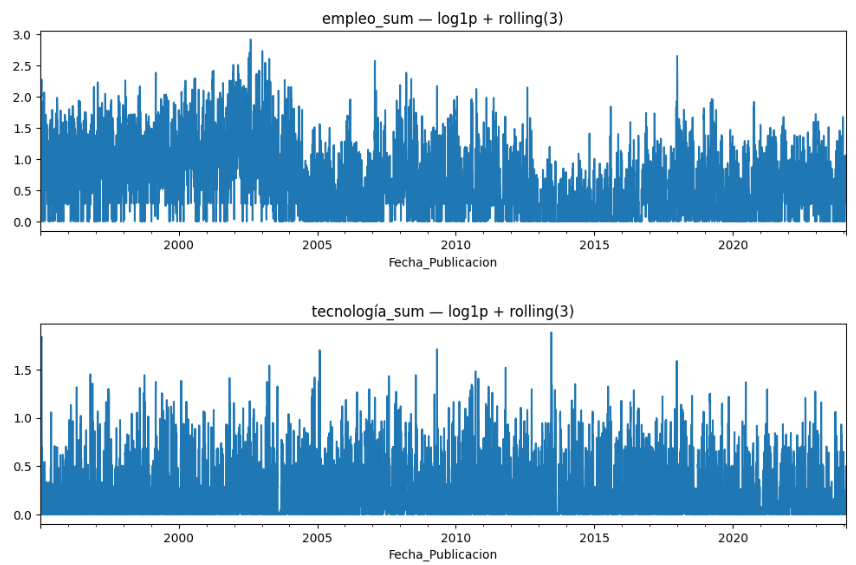

Se utilizó el Test de Dickey-Fuller Aumentado (ADF) para confirmar que, tras la transformación, se había eliminado la raíz unitaria. Dado que el p-value es significativamente menor que 0.01 en ambos casos, se rechaza la hipótesis nula. Esto valida que las series transformadas son estacionarias. Por consiguiente, el orden de diferenciación no estacional (d) para los modelos ARIMA y SARIMAX se fijó en d=0 (es decir, el modelado se centra en ARMA(p, q)).

## 2. Modelado y Evaluación de la Capacidad Predictiva
La siguiente fase se enfocó en seleccionar la mejor estructura de modelado para el pronóstico de la media.

### 2.2.1. ARMA (p, 0, q)
El modelo ARMA fue el punto de partida, asumiendo que la autocorrelación de las series transformadas podía explicarse únicamente por componentes no estacionales. Se realizó una búsqueda exhaustiva (Grid Search) para el mejor orden (p, q) en el rango [0, 4], seleccionando los parámetros que minimizan el AIC. El AIC penaliza la complejidad del modelo (más parámetros), favoreciendo el ajuste parsimonioso.

A pesar de optimizar el AIC, los resultados de forecast en el conjunto de prueba (Test set) fueron insuficientes. El modelo mostró una subestimación sistemática de los valores reales y una fuerte regresión a la media. Esto es una evidencia clara de que la estacionalidad inherente a la serie diaria (e.g., el ciclo semanal) no estaba siendo capturada.

 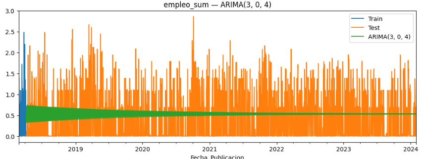
 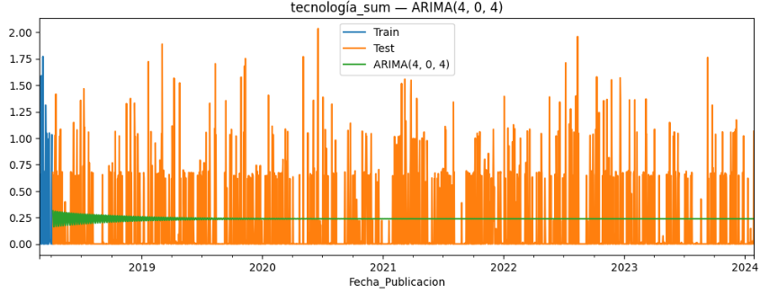

 
### 2.2.2. SARIMAX 
Para corregir las deficiencias del ARMA, se implementó el SARIMAX (Seasonal ARIMA with Exogenous Regressors).
El modelo se especificó para incluir los siguientes componentes:

- Estacionalidad Semanal (s=7): Dado el carácter diario de la serie y los patrones observados, se estableció s=7.
- Orden Estacional (P, D, Q, s): Se utilizó un orden simple (1, 0, 1, 7) con diferenciación estaciona lD=0, ya  que el suavizado de la media móvil ya había estabilizado la varianza.
- Variables Exógenas (X): Se incluyeron las otras nueve series del dataset (las series *_count) para modelar la interdependencia, asumiendo que la actividad de un indicador influye en el comportamiento de los demás.

La inclusión de la estacionalidad y las variables exógenas resultó en una mejora significativa. El forecast de SARIMAX fue capaz de seguir con mayor precisión las fluctuaciones periódicas y la tendencia general del conjunto de prueba.

 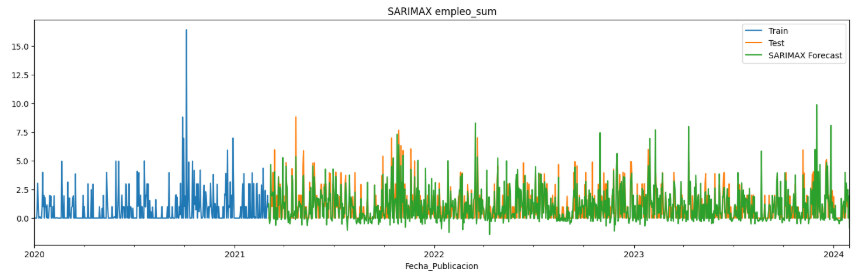
 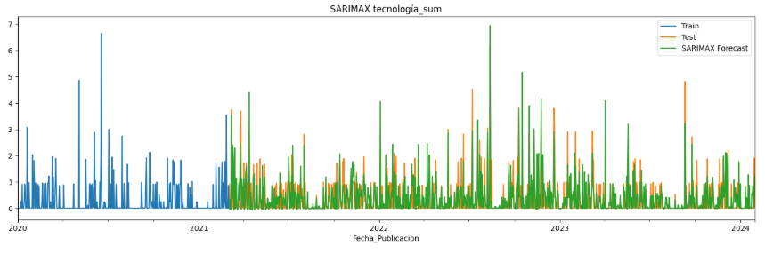

### 2.2.3. Prophet
Se incluyó el modelo Prophet (desarrollado por Meta) como benchmark, ya que está optimizado para series temporales con datos atípicos, tendencias variables y múltiples estacionalidades. Prophet modela la serie mediante la descomposición de componentes: tendencia, estacionalidad aditiva y efectos de festivos.

 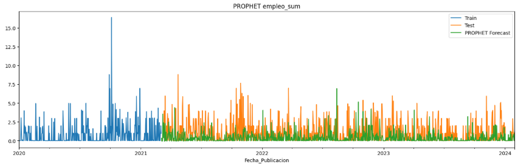
 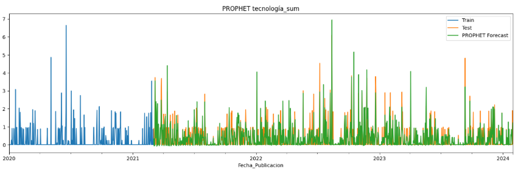

## 2.3 Resultados de Rendimiento 
La selección final del modelo se basó en el Root Mean Square Error (RMSE), una métrica que penaliza los errores grandes y evalúa la capacidad del modelo para pronosticar con precisión en la escala original de los datos.

La siguiente tabla consolida las métricas clave de los modelos probados:

 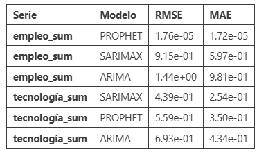
 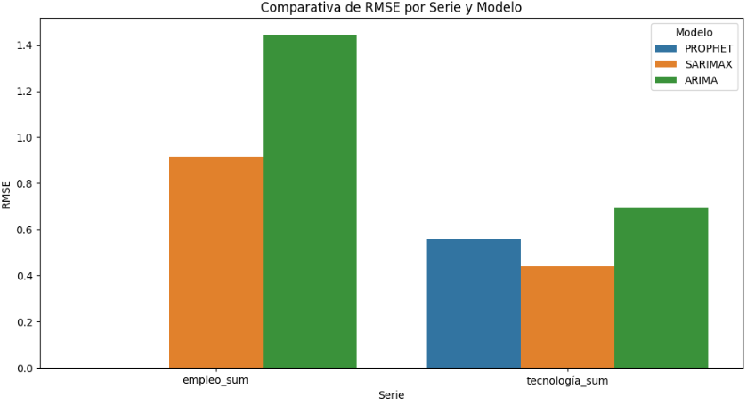
 
 
El análisis demostró que el rendimiento óptimo difiere entre las dos series, requiriendo una estrategia de modelado específica para cada una:

- Modelo ARMA Inadecuado: El bajo rendimiento de los modelos ARMA puros (con el RMSE más alto) confirma que el problema de pronóstico está dominado por la estacionalidad y/o la interdependencia, no solo por la autocorrelación de corto plazo.
- Modelo Óptimo para empleo_sum: El modelo Prophet mostró una precisión abrumadora. Se selecciona Prophet porque su enfoque en la descomposición robusta de tendencia y estacionalidad no lineal es ideal para series que puedan haber experimentado varios shocks o cambios estructurales a lo largo de 30 años.
- Modelo Óptimo para tecnología_sum: El modelo SARIMAX con exógenas es el más preciso. Esto valida la hipótesis de que la serie tecnología_sum mantiene una estructura lineal estacional bien definida y está fuertemente influenciada por la dinámica de los demás indicadores (exógenas), factores que SARIMAX modela de manera explícita y eficiente.

## 3. GARCH y ARCH
En esta sección analizamos la volatilidad de la influencia de tecnología y empleo en las universidades públicas de Madrid mediante GARCH y ARCH.

### 3.1 Tecnología
En primer lugar, llevamos a cabo el test ADF, con los valores de 1%, 5% y 10% vemos que nuestro ADF statistic (-15.78) es mucho menor que el nivel 1% (-3.43), nivel 5% (-2.86) y el nivel 10% (-2.56), lo que nos confirma que la serie es estacionaria con un nivel de confianza altísimo, perfecto para aplicar GARCH.

**Retornos**
Después calculamos los retornos al cuadrado
 

Y representamos el PACF, Partial Autocorrelation Function (Función de Autocorrelación Parcial), que es una herramienta que nos ayuda a entender cómo una serie temporal se relaciona consigo misma en distintos periodos de tiempo. 

 

Ninguna barra sobresale claramente del intervalo de confianza (zona azul), esto significa que no hay correlación en los retornos al cuadrado. Solo hay dos picos aislados en los lags 27 y 29, que sobresalen algo más que los demás y que pueden sugerir un pequeño ciclo que se repite cada 27-29 días. Esto encaja con posibles ritmos administrativos o de publicación de normativas, que suelen seguir patrones mensuales. Al no haber más picos significativos, concluimos que los movimientos de un día apenas afectan a los días siguientes.

Una vez tenemos los retornos, calculamos el modelo GARCH con p=1 y q=1. Sin embargo, añadimos rescale=True ya que, de lo contrario, la escala es muy grande y los valores de alfa y beta pueden ser 0.0000 porque pierde capacidad de representación. 
Los resultados muestran un comportamiento muy estable. El parámetro α, que mide la sensibilidad de la volatilidad frente a cambios repentinos en la serie, es prácticamente cero y no resulta significativo. Esto indica que los movimientos bruscos de un día concreto no afectan de manera apreciable a la volatilidad futura. En otras palabras, aunque pueda haber variaciones puntuales, estas no generan un aumento inmediato de la incertidumbre.

Por el contrario, el parámetro β es elevado y estadísticamente significativo. Esto significa que la volatilidad depende casi exclusivamente de su propio comportamiento pasado: si en periodos anteriores la variabilidad ha sido baja y estable, esa estabilidad tiende a mantenerse. El modelo refleja, por tanto, un patrón de volatilidad persistente pero suave, sin episodios prolongados de alta o baja variabilidad.

Además, probamos modelos más complejos de GARCH, pero no ofrecen mejoras superiores al 5% en los criterios AIC, BIC o LLF respecto a GARCH(1,1).

**Predicción del futuro**

Durante el proceso de selección del modelo GARCH(p,q) se empleó la serie completa, ya que el objetivo en esta fase es evaluar qué especificación ajusta mejor la dinámica de volatilidad. Para este propósito, utilizar toda la información histórica permite obtener estimaciones más estables de los parámetros y comparar modelos mediante criterios como AIC, BIC y LLF.

Sin embargo, en la fase de predicción se establece una fecha límite (equivalente a un procedimiento de train/test), entrenando el modelo únicamente con datos previos a dicha fecha. Esto evita introducir información futura en el proceso de estimación y permite evaluar la capacidad predictiva del modelo de manera realista.

 

El pronóstico de volatilidad generado por el modelo GARCH(1,1) muestra un valor constante a lo largo del tiempo. Esto ocurre porque, en el modelo ajustado, el parámetro α es prácticamente cero, lo que significa que los cambios recientes en la serie no tienen efecto sobre la volatilidad futura. La volatilidad depende casi exclusivamente del componente constante y de la volatilidad pasada, que en este caso se estabiliza rápidamente en un nivel de largo plazo. Por esta razón, el modelo predice el mismo valor de volatilidad para cada periodo, reflejando que la serie no presenta rachas prolongadas de alta o baja variabilidad, sino episodios puntuales de cambio.

Para el siguiente periodo (horizon = 2), el modelo predice una media esperada de 2.5305, y una volatilidad del 43.66%. Esto muestra que se espera un aumento en los retornos para el siguiente periodo, aunque acompañado de una alta volatilidad, lo que indica que los movimientos pueden ser muy grandes en cualquier dirección. Esto se relaciona con nuestra hipótesis, que plantea que la influencia de la tecnología ha ido creciendo un 1,1% a lo largo del tiempo. El aumento proyectado en los retornos puede reflejar este efecto positivo de la tecnología, mientras que la alta volatilidad sugiere que, a pesar de la influencia creciente, todavía hay bastante incertidumbre en cómo se comportarán los resultados.

**Hampel filter**
Para depurar la serie y reducir el efecto de valores atípicos extremos, aplicamos el Hampel Filter, un método que identifica y reemplaza automáticamente los outliers basándose en la mediana y la desviación típica local de la serie. Tras aplicar este filtro, la serie queda más limpia, eliminando picos aislados que podrían distorsionar el análisis de volatilidad. Esto nos permite obtener un pronóstico más fiable, ya que el modelo GARCH no se ve afectado por cambios extraordinarios puntuales que no reflejan la dinámica general de la influencia tecnológica.

 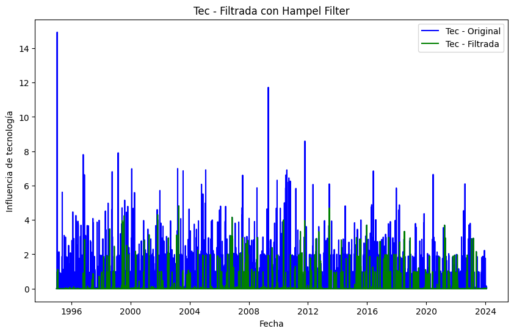

Después calculamos los retornos, que incluso aplicando Hampel Filter, los retornos siguen mostrando valores extramadamente grandes y negativos cercanos a -1. Esto pasa porque tenemos valores muy pequeños o 0 (poca influencia de tecnología) en el denominador.

Al hacer el PACF a la serie filtrada obtenemos una línea plana en 0 la cual indica que no hay clustering de volatilidad, los picos son eventos puntuales, es decir, la volatilidad no depende de los valores anteriores, no hay memoria en la serie.

Volviendo a aplicar GARCH vemos que la influencia tecnológica en el BOE sigue mostrando cambios puntuales, pero con una volatilidad más estable.

Los resultados muestran que los cambios recientes en la serie ahora tienen un efecto moderado, mientras que la volatilidad pasada sigue influyendo, pero de manera menos persistente que en la serie original. Esto refleja que, aunque la serie puede experimentar fluctuaciones aisladas, no se producen rachas prolongadas de alta o baja variabilidad.

El pronóstico para el siguiente periodo, generado sobre la serie filtrada con Hampel, indica que la media esperada de la influencia tecnológica en las disposiciones del BOE es de 2.4454, mientras que la volatilidad esperada es de aproximadamente 21.94%. Esto refleja que, aunque se esperan fluctuaciones puntuales en la serie, los cambios no son extremos ni sostenidos en el tiempo. La volatilidad moderada sugiere que los picos de actividad tecnológica son predecibles dentro de un rango razonable y que la serie mantiene cierta estabilidad general a lo largo del periodo analizado.

### 3.2 Empleo

Para los datos de empleo volvemos a hacer el mismo procedimiento. Los datos son así:

 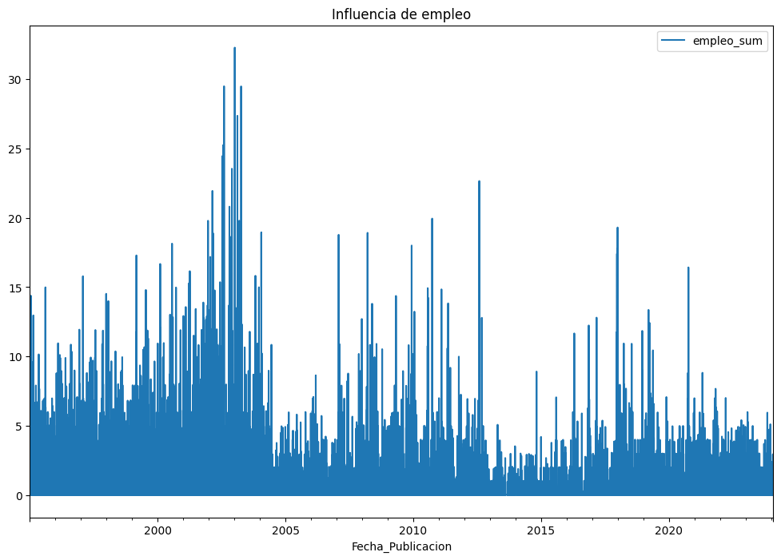

En la gráfica observamos que entre el 1996 y el 2004, aproximadamente, la influecia de empleo en el BOE era mayor que el resto de años. Esto puede ser porque durante finales de los años 90 y comienzos de los 2000, muchas economías, incluida España, experimentaron un crecimiento económico sostenido. Esto impulsó la creación de empleo y aumentó la actividad laboral.

Además, en España, especialmente, hubo un crecimiento fuerte del sector de la construcción y un impulso inicial de la tecnología y telecomunicaciones, lo que elevó la demanda de trabajo. Durante ese periodo se implementaron políticas que fomentaban la contratación y el crecimiento del empleo, además de incentivos fiscales en algunos sectores estratégicos. Tras 2004, la serie muestra menor influencia porque eventos como la burbuja inmobiliaria y la crisis financiera de 2008 redujeron la creación de empleo y aumentaron la incertidumbre laboral, disminuyendo la estabilidad en la serie.

Entre 2012 y 2016, España atravesó la fase más dura de la crisis económica iniciada en 2008, con altos niveles de desempleo y poca creación de empleo. Durante estos años, la influencia de los factores que impulsaban el empleo se redujo drásticamente.

Al hacer el test ADF vemos que el p-valor es muy pequeño, así que se rechaza la hipótesis nula de no estacionariedad, por lo tanto, la serie es estacionaria.

Al caluclar los retornos y mostras el gráfico de PACF:

 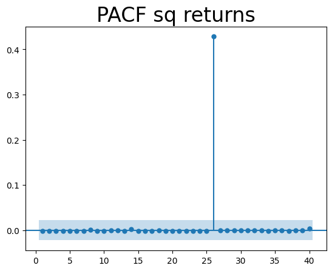

Muestra un pico muy alto en el lag 27, lo que indica que hay una racha de volatilidad significativa que se repite aproximadamente cada 27 periodos. Esto sugiere que, a diferencia de la serie de tecnología, la serie de empleo presenta cierta dependencia temporal en la variabilidad, es decir, los cambios fuertes tienden a agruparse en intervalos específicos.

Este comportamiento puede reflejar eventos periódicos o efectos estacionales, como decisiones administrativas, políticas de contratación o cierres de ciclos que impactan de manera notable en los datos de empleo. La presencia de este pico implica que un modelo GARCH podría captar mejor la dinámica de volatilidad en esta serie, ya que los episodios de mayor variabilidad no son completamente aleatorios y muestran cierta memoria.

Después, aplicamos el modelo GARCH(1,1). Este  indica que la media esperada de la serie de empleo es de aproximadamente 2.21, lo que refleja un nivel promedio positivo y estable de cambios en la serie. En cuanto a la volatilidad, se observa un comportamiento característico: la componente α₁, que representa la reacción de la volatilidad a cambios recientes, es baja (0.0416) y no significativa, mientras que β₁ es alta (0.9231), indicando que la volatilidad pasada influye fuertemente en la volatilidad futura. Esto se corresponde con la observación del PACF de los cuadrados de los retornos, donde la alta persistencia sugiere que los periodos de mayor volatilidad tienden a mantenerse a lo largo del tiempo, mostrando un patrón estable y predecible en los cambios de empleo.

**Predicción a futuro**

Repitiendo lo mismo que para tecnología, el pronóstico para el siguiente periodo de la serie de empleo indica que la media esperada es de aproximadamente 1.5767, lo que refleja un nivel promedio estable de cambios en la serie. En cuanto a la volatilidad, se observa un comportamiento característico: la volatilidad esperada es del 19.22%, lo que sugiere que, aunque pueden producirse fluctuaciones puntuales, estas no son extremas ni totalmente impredecibles. Esto se corresponde con la observación del PACF de los cuadrados de los retornos y con los parámetros del modelo GARCH, donde la alta persistencia de la volatilidad indica que los periodos de mayor o menor variabilidad tienden a mantenerse a lo largo del tiempo, mostrando un patrón relativamente estable en los cambios de empleo.

**Hampel Filter**

Tras aplicar el filtro de Hampel a la serie de empleo, los valores atípicos se suavizan, eliminando picos extremos que podrían distorsionar la estimación de la volatilidad. Al ajustar el modelo GARCH(1,1) sobre la serie filtrada, se observa que la media esperada es de 4.44, reflejando un nivel promedio de cambios relativamente estable en la serie.

En cuanto a la volatilidad, los parámetros α₁ y β₁ resultan prácticamente nulos o no significativos, lo que indica que la serie filtrada no muestra efectos persistentes de volatilidad; los cambios extremos anteriores no tienen influencia notable en los futuros. Esto se interpreta como que, una vez eliminados los outliers, la serie de empleo se comporta de manera más estable y menos “reactiva” a fluctuaciones puntuales, haciendo que la variabilidad sea más predecible y menos extrema que en la serie original.

La volatilidad observada en la serie original de Empleo era producto de eventos extremos (outliers). Al suavizar la serie, el modelo GARCH deja de ser necesario o efectivo, indicando que la serie 'normal' (sin eventos extremos) tiene una varianza constante.

Y por último, predecimos el siguiente periodo. Aunque la media (4.4424) de la serie de empleo filtrada se mantiene estable, la volatilidad (62.57%) prevista sigue siendo alta. Esto se debe a que, si bien se han eliminado los valores atípicos más extremos, la serie aún conserva episodios de cambios relativamente marcados que hacen que la variabilidad futura pueda ser significativa.

### Conclusiones GARCH

El análisis de tecnlogía muestra que la media de los retornos es positiva, esto indica que, si bien existe una inercia diaria hacia el crecimiento, la serie es altamente intermitente y volátil. 

Por su parte, la serie de empleo muestra una estructura de volatilidad que, tras el filtrado, pierde su persistencia. Esto implica que los movimientos futuros en la influencia del empleo, aunque seguirán una tendencia a la baja, serán más irregulares y aleatorios (ruido blanco) de lo que sugerían los picos extremos de la serie original.

## Análisis de tendencia anual

Como solo tenemos 30 datos para datos anuales, vamos a hacer una regresión lineal simple que no necesita muchos datos. Para ambos campos calculamos la pendiente. Para tecnología la pendiente tiene un valor de -0.8506 y un p-valor = 0.3044; para empleo la pendiente = -23.8645 y 

 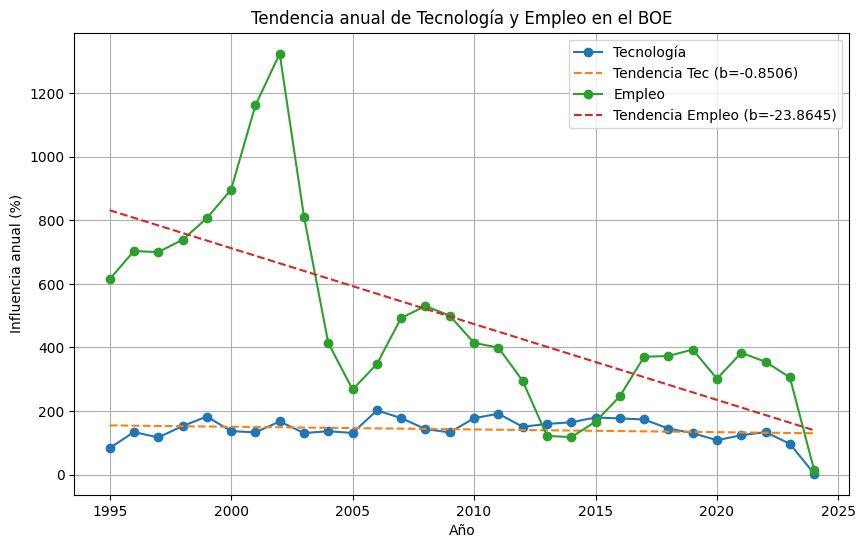

La pendiente anual de la influencia de tecnología ha disminuido ligeramente en lugar de aumentar como expresábamos en nuestra hipótesis. Sin embargo, el p-valor es 0.3044, la pendiente no es estadísticamente significativa. Esto refuerza que no hay evidencia clara de aumento anual en la influencia tecnológica en la serie de 1995–2024.

En cuanto al empleo, la pendiente anual de empleo es de -23.8645, es decir, que disminuye fuertemente cada año, más de lo esperado en nuestra hipótesis. El p-valor = 0.0000 indica que la tendencia decreciente es real y consistente.

## Conclusiones
AQUÍ PONER
hipótesis apoyada o refutada. 
▪ Limitaciones y posibles mejoras. 
