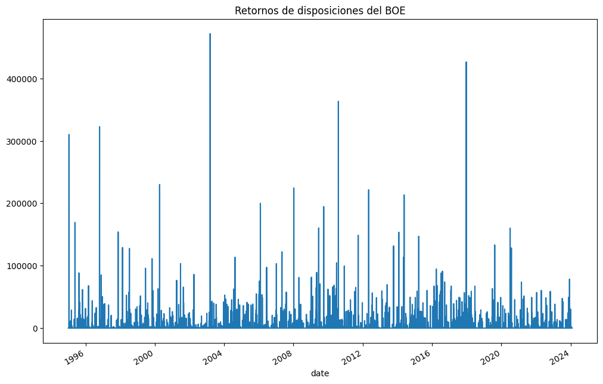
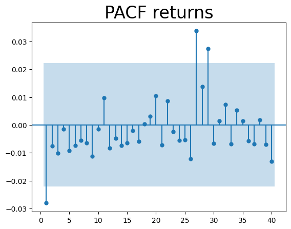
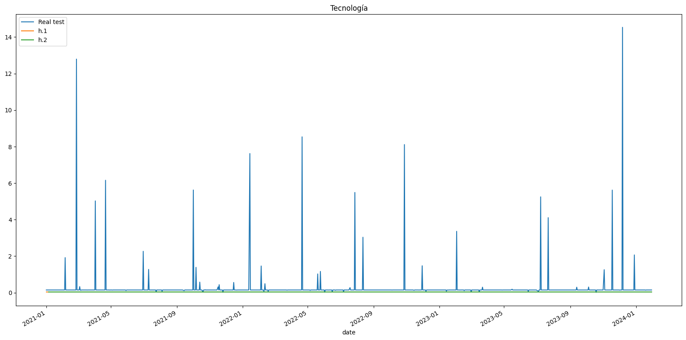

# Entrega 3: Análisis temporal de las disposiciones del BOE

En esta entrega analizamos nuestros datos teniendo en cuenta la componente temporal. Además, usamos los modelos ARIMAX, SARIMAX, modelos profundos, GARCH y ARCH para contrastar nuestra hipótesis:

``` Entre 1995 y 2024, la proporción de titulares del BOE relacionados con tecnología en universidades públicas de la Comunidad de Madrid aumenta moderadamente (≈ +1.1% anual), mientras que los relativos a empleo muestran una tendencia variable con disminución general (≈ -2.3% anual), lo que sugiere un cambio gradual de foco institucional desde temas laborales hacia la innovación tecnológica. ``` 
## 1. Visualizaciones

## 2. ARIMAX y SARIMAX

## 3. GARCH y ARCH
En esta sección analizamos la volatilidad de la influencia de tecnología y empleo en las universidades públicas de Madrid mediante GARCH y ARCH.

### 3.1 Tecnología
En primer lugar, llevamos a cabo el test ADF, con los valores de 1%, 5% y 10% vemos que nuestro ADF statistic (-15.78) es mucho menor que el nivel 1% (-3.43), nivel 5% (-2.86) y el nivel 10% (-2.56), lo que nos confirma que la serie es estacionaria con un nivel de confianza altísimo, perfecto para aplicar GARCH.

**Retornos**
Después calculamos los retornos
 

Y representamos el PACF, Partial Autocorrelation Function (Función de Autocorrelación Parcial), que es una herramienta que nos ayuda a entender cómo una serie temporal se relaciona consigo misma en distintos periodos de tiempo. 

 

Vemos tres picos sobre salientes de la zona de confianza, el 1, 27 y 29. El primero de ellos es negativo, esto podría indicar que si un día (o periodo) se publica una disposición con una influencia tecnológica muy alta, es muy probable que la disposición del periodo siguiente tenga una influencia baja (y viceversa). Los lag del 27 y el 29 indican que existe un patrón cíclico. La influencia de la tecnología tiende a repetirse o "hacer eco" cada 27-29 periodos. Unos 27-30 días es aproximadamente un mes. Esto podría sugerir que ciertos informes, subvenciones o normativas tecnológicas se publican en ciclos mensuales (por ejemplo, a finales o principios de mes).

Una vez tenemos los retornos, calculamos el modelo GARCH con p=1 y q=1. Sin embargo, añadimos rescale=True ya que, de lo contrario, la escala es muy grande y los valores de alfa y beta pueden ser 0.0000 porque pierde capacidad de representación. 
Al eliminar el ruido (rescale=True), hay un "nivel base" de influencia tecnológica constante. No oscila alrededor de cero; la tecnología siempre está presente con una intensidad base en las disposiciones. La media mu (2.5475) indica que al ser un número positivo y estadísticamente significativo, el modelo rechaza la idea de que la influencia sea estática (cero) o decreciente, lo que concuerda con nuestra hipótesis de que la influencia de la tecnología aumenta.

Según los resultados de omega (22.5497), alpha (4.76e-04), podemos interpretar que la volatilidad de las disposiciones tecnológicas en el BOE no depende tanto de shocks inmediatos, ya que alpha es prácticamente cero y no significativo. Esto indica que un pico repentino en titulares o disposiciones tecnológicas no genera un aumento fuerte e inmediato de la variabilidad.

En cambio, la volatilidad depende principalmente de la volatilidad pasada, como muestra el valor elevado de beta (≈ 0.89). Esto significa que cuando la actividad tecnológica del BOE entra en una fase más variable —por ejemplo, semanas con muchas disposiciones heterogéneas— esa variabilidad tiende a persistir y extenderse en el tiempo, propagándose a días siguientes.

**Predicción del futuro**

Tras comparar distintas configuraciones del modelo GARCH y probar tanto la distribución normal como la t-Student, observamos que, aunque algunos modelos más complejos pueden ajustar ligeramente mejor, la serie presenta picos puntuales y la volatilidad no tiene memoria fuerte. Por esta razón, para predecir el futuro utilizaremos GARCH(1,1), ya que es suficiente, estable y más fácil de interpretar que modelos con valores mayores de p y q.

 

El pronóstico de volatilidad generado por el modelo GARCH(1,1) muestra un valor constante a lo largo del tiempo, con excepción de la primera fecha, que aparece como NaN por no existir información previa para calcularla. Esto ocurre porque, en el modelo ajustado, el parámetro α es prácticamente cero, lo que significa que los cambios recientes en la serie no tienen efecto sobre la volatilidad futura. La volatilidad depende casi exclusivamente del componente constante y de la volatilidad pasada, que en este caso se estabiliza rápidamente en un nivel de largo plazo. Por esta razón, el modelo predice el mismo valor de volatilidad para cada periodo, reflejando que la serie no presenta rachas prolongadas de alta o baja variabilidad, sino episodios puntuales de cambio. Esto concuerda con la observación de que la influencia tecnológica en las disposiciones del BOE presenta picos puntuales pero no rachas prolongadas de variabilidad.

Para el siguiente periodo (horizon = 1), el modelo predice una media esperada de 2.7063, lo que indica el valor central alrededor del cual se espera que fluctúen los cambios. La predicción constante de la volatilidad se debe a que el modelo asigna un efecto mínimo a los shocks recientes, concentrándose en la estabilidad de la varianza de largo plazo. La volatilidad del 15% no significa “extremadamente alta”, sino que indica que los cambios diarios pueden variar en torno a ±15% de la media esperada. Esto es una variabilidad estable pero moderada, aunque pueden aparecer picos puntuales en algunos días sin alterar la estabilidad general de la serie.

## Conclusiones
AQUÍ PONER
hipótesis apoyada o refutada. 
▪ Limitaciones y posibles mejoras. 
